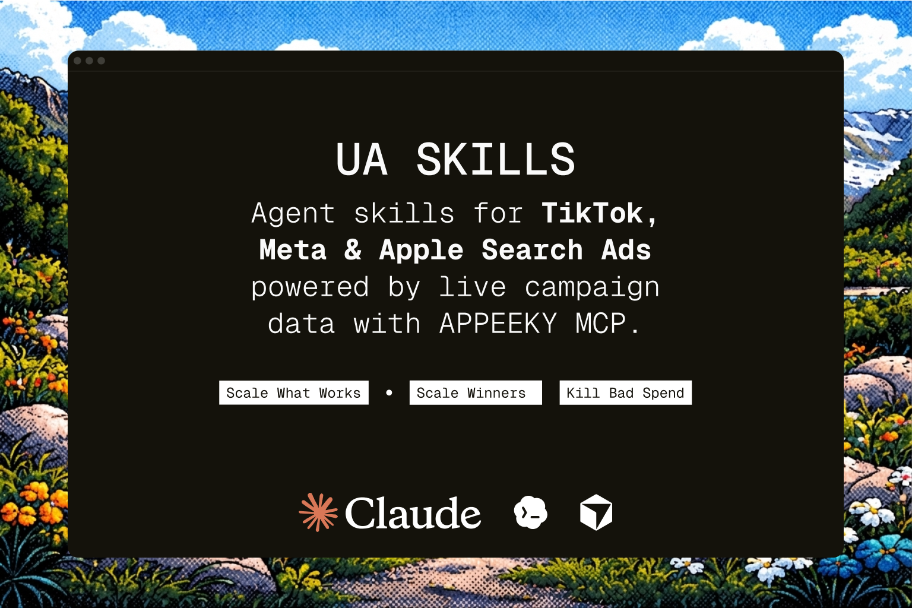

# UA Skills


<a href="https://www.appeeky.com">
  
</a>
<div align="center">
<p align="center">
  <a href="https://x.com/appeeky">
    
  </a>
  <a href="https://www.linkedin.com/in/erencanarica/">
    
  </a>
  </p>
</div>

AI agent skills for mobile app user acquisition — TikTok ads, Meta ads, Apple Search Ads, ad creatives, and ROAS. Built for indie developers and growth teams using **Cursor**, **Claude Code**, or any [Agent Skills](https://agentskills.io)-compatible assistant.

Powered by live campaign data via the [Appeeky API](https://docs.appeeky.com) — Meta Marketing API, TikTok Marketing API, Apple Search Ads, App Ad Creatives, and RevenueCat.

For organic ASO and App Store listing optimization, see [aso-skills](https://github.com/eronred/aso-skills).

## For people who want App Growth locally

A native macOS app — a local-first for app growth. App Store Connect, Google Play, Apple Search Ads, Meta/TikTok ads, and RevenueCat sync into a cache on your Mac: full history, no CSV exports, credentials in the Keychain. Reviews, ads intelligence, and keyword data stay fast (and work offline). A built-in terminal pairs with MCP, so the same agents that use these skills can talk to your local data. Download from [Appeeky](https://appeeky.com/desktop).

 <a href="https://www.appeeky.com/desktop">

</a>

## Why This Exists

Generic LLMs default to Traffic campaigns, $10/day, and install-optimize. That burns the first budget. These skills force App Promotion, $30–50/day tests, Purchase/Subscribe optimization, PAUSED drafts until you approve, and a 48h kill window.

Each skill is a UA playbook plus an Appeeky copilot — not a generic ads chatbot.

## Quick Start

**Cursor** — Settings (Cmd+Shift+J) → Rules → Add Rule → Remote Rule (Github) → paste `https://github.com/appeeky/ua-skills`

**Claude Code** — `npx skills add appeeky/ua-skills`

**Manual** — `git clone https://github.com/appeeky/ua-skills.git && cp -r ua-skills/skills/* .cursor/skills/`

Then ask:

```
"Set up TikTok app install ads for my meditation app"
"Generate a Meta ad creative from my App Store listing"
"Are my TikTok ads profitable? CPA is $18"
"Create 6 TikTok ad concepts for a glow-up app"
"What's my ASA ROAS by keyword?"
"Upload my ad creative to Meta as a draft"
"Compare TikTok vs Meta performance"
```

**Don't want to remember 24 skill names?** Use the router:

```
/ua-skill  →  routes your request to the right specialist automatically
```

Or invoke directly: `/tiktok-campaign-setup`, `/meta-ad-creative`, `/asa-roas-analysis`, `/campaign-profitability`, `/mmp-setup`

## Skills

### Foundation

| Skill | What it does |
|-------|-------------|
| [`ads-router`](skills/ads-router) | Routes any paid UA request to the right skill |
| [`app-ads-context`](skills/app-ads-context) | Budget, CPA targets, connected accounts context doc |
| [`mmp-setup`](skills/mmp-setup) | MMP setup before spending — **run first** |

### Creative Pipeline (Appeeky App Ad Creatives)

| Skill | What it does |
|-------|-------------|
| [`meta-ad-creative`](skills/meta-ad-creative) | Listing → 1024×1024 PNG + Meta copy |
| [`ad-creative-variants`](skills/ad-creative-variants) | 3–5 angle/style A/B batch |
| [`ad-creative-edit`](skills/ad-creative-edit) | Natural-language creative iteration |
| [`ad-creative-to-meta`](skills/ad-creative-to-meta) | Full pipeline: creative → Meta draft ad |
| [`competitor-ad-teardown`](skills/competitor-ad-teardown) | Meta Ad Library competitive analysis |

### TikTok Ads

| Skill | What it does |
|-------|-------------|
| [`tiktok-campaign-setup`](skills/tiktok-campaign-setup) | Campaign structure, placements, tracking, Smart+ |
| [`tiktok-creative-strategy`](skills/tiktok-creative-strategy) | 6-ad matrix, formats, hooks, production |
| [`tiktok-spark-ads`](skills/tiktok-spark-ads) | Organic post → Spark code → paid |
| [`tiktok-campaign-audit`](skills/tiktok-campaign-audit) | CPA review, scale/kill, failure analysis |

### Meta Ads

| Skill | What it does |
|-------|-------------|
| [`meta-campaign-setup`](skills/meta-campaign-setup) | App promotion campaign structure |
| [`meta-campaign-audit`](skills/meta-campaign-audit) | Performance review |
| [`meta-budget-optimizer`](skills/meta-budget-optimizer) | Scale/pause budget rules |

### Apple Search Ads

| Skill | What it does |
|-------|-------------|
| [`asa-roas-analysis`](skills/asa-roas-analysis) | ASA spend × RevenueCat revenue |
| [`asa-weekly-optimization`](skills/asa-weekly-optimization) | Weekly keyword maintenance |
| [`asa-negative-keywords`](skills/asa-negative-keywords) | Block wasted search terms |
| [`asa-admaxxing`](skills/asa-admaxxing) | Scale playbook + recommendations |

### Measurement

| Skill | What it does |
|-------|-------------|
| [`subscription-snapshot`](skills/subscription-snapshot) | RevenueCat MRR, trials, revenue |
| [`campaign-profitability`](skills/campaign-profitability) | LTV vs CPA, margin analysis |
| [`cross-channel-performance`](skills/cross-channel-performance) | TikTok + Meta + ASA unified report |
| [`cross-channel-budget`](skills/cross-channel-budget) | Monthly budget allocation |

### Other

| Skill | What it does |
|-------|-------------|
| [`google-uac-campaign`](skills/google-uac-campaign) | Google UAC framework (no API yet) |

## How It Works

```
You: "Generate a Meta ad from my App Store listing and upload it"

Agent:
  1. Reads meta-ad-creative/SKILL.md
  2. Calls generate_app_ad_creative → polls job
  3. Reads ad-creative-to-meta/SKILL.md
  4. Uploads image → creates Meta draft ad (PAUSED)
  5. Returns copy + preview URL + next steps
```

## Installation

### Cursor

| Method | Command |
|--------|---------|
| GitHub Import | Settings → Rules → Add Rule → Remote Rule → `https://github.com/appeeky/ua-skills` |
| Project-level | `cp -r ua-skills/skills/* .cursor/skills/` |
| Global | `cp -r ua-skills/skills/* ~/.cursor/skills/` |

### Claude Code

| Method | Command |
|--------|---------|
| CLI | `npx skills add appeeky/ua-skills` |
| Specific skills | `npx skills add appeeky/ua-skills --skill tiktok-campaign-setup meta-ad-creative` |
| Manual | `cp -r ua-skills/skills/* .claude/skills/` |

### Any Agent

```bash
git submodule add https://github.com/appeeky/ua-skills.git .agents/ua-skills
```

Works with any tool that supports the [Agent Skills](https://agentskills.io) standard (`.agents/skills/`, `.cursor/skills/`, `.claude/skills/`, `.codex/skills/`).

## Appeeky Integration

Skills work standalone with UA frameworks. Connect [Appeeky MCP](https://docs.appeeky.com/docs/mcp) for live campaign data and writes:

```json
{
  "mcpServers": {
    "appeeky": {
      "url": "https://mcp.appeeky.com/mcp",
      "headers": { "Authorization": "Bearer apk_your_key_here" }
    }
  }
}
```

Connect ad accounts in [appeeky.com → Settings → Integrations](https://appeeky.com) for Meta, TikTok, Apple Search Ads, and RevenueCat.

See [tools/REGISTRY.md](tools/REGISTRY.md) for the full capability matrix.

## Typical Flows

| Goal | Skills (in order) |
|------|-------------------|
| TikTok from zero | `mmp-setup` → `tiktok-campaign-setup` → `tiktok-creative-strategy` → `tiktok-spark-ads` → `tiktok-campaign-audit` |
| Meta from listing | `meta-ad-creative` → `ad-creative-to-meta` |
| Scale profitably | `campaign-profitability` → channel audit → `meta-budget-optimizer` |
| Beat competitor | `competitor-ad-teardown` → `ad-creative-variants` |

## Contributing

PRs welcome — fix an inaccuracy, improve a framework, or add a new skill. See [CONTRIBUTING.md](CONTRIBUTING.md).

## License

MIT
